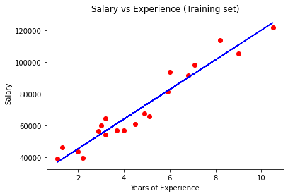
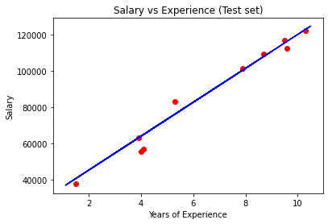

[Types of variables](https://www.statisticshowto.com/probability-and-statistics/types-of-variables/)
[Types of variables](https://www.educba.com/types-of-variables-in-statistics/)

# Simple Linear Regression

## Importing the libraries


```python
import numpy as np
import matplotlib.pyplot as plt
import pandas as pd
```

## Importing the dataset


```python
dataset = pd.read_csv('Salary_Data.csv')
X = dataset.iloc[:, :-1].values
y = dataset.iloc[:, -1].values
```


```python
dataset
```


<div>
<style scoped>
    .dataframe tbody tr th:only-of-type {
        vertical-align: middle;
    }

    .dataframe tbody tr th {
        vertical-align: top;
    }

    .dataframe thead th {
        text-align: right;
    }
</style>
<table border="1" class="dataframe">
  <thead>
    <tr style="text-align: right;">
      <th></th>
      <th>YearsExperience</th>
      <th>Salary</th>
    </tr>
  </thead>
  <tbody>
    <tr>
      <th>0</th>
      <td>1.1</td>
      <td>39343.0</td>
    </tr>
    <tr>
      <th>1</th>
      <td>1.3</td>
      <td>46205.0</td>
    </tr>
    <tr>
      <th>2</th>
      <td>1.5</td>
      <td>37731.0</td>
    </tr>
    <tr>
      <th>3</th>
      <td>2.0</td>
      <td>43525.0</td>
    </tr>
    <tr>
      <th>4</th>
      <td>2.2</td>
      <td>39891.0</td>
    </tr>
    <tr>
      <th>5</th>
      <td>2.9</td>
      <td>56642.0</td>
    </tr>
    <tr>
      <th>6</th>
      <td>3.0</td>
      <td>60150.0</td>
    </tr>
    <tr>
      <th>7</th>
      <td>3.2</td>
      <td>54445.0</td>
    </tr>
    <tr>
      <th>8</th>
      <td>3.2</td>
      <td>64445.0</td>
    </tr>
    <tr>
      <th>9</th>
      <td>3.7</td>
      <td>57189.0</td>
    </tr>
    <tr>
      <th>10</th>
      <td>3.9</td>
      <td>63218.0</td>
    </tr>
    <tr>
      <th>11</th>
      <td>4.0</td>
      <td>55794.0</td>
    </tr>
    <tr>
      <th>12</th>
      <td>4.0</td>
      <td>56957.0</td>
    </tr>
    <tr>
      <th>13</th>
      <td>4.1</td>
      <td>57081.0</td>
    </tr>
    <tr>
      <th>14</th>
      <td>4.5</td>
      <td>61111.0</td>
    </tr>
    <tr>
      <th>15</th>
      <td>4.9</td>
      <td>67938.0</td>
    </tr>
    <tr>
      <th>16</th>
      <td>5.1</td>
      <td>66029.0</td>
    </tr>
    <tr>
      <th>17</th>
      <td>5.3</td>
      <td>83088.0</td>
    </tr>
    <tr>
      <th>18</th>
      <td>5.9</td>
      <td>81363.0</td>
    </tr>
    <tr>
      <th>19</th>
      <td>6.0</td>
      <td>93940.0</td>
    </tr>
    <tr>
      <th>20</th>
      <td>6.8</td>
      <td>91738.0</td>
    </tr>
    <tr>
      <th>21</th>
      <td>7.1</td>
      <td>98273.0</td>
    </tr>
    <tr>
      <th>22</th>
      <td>7.9</td>
      <td>101302.0</td>
    </tr>
    <tr>
      <th>23</th>
      <td>8.2</td>
      <td>113812.0</td>
    </tr>
    <tr>
      <th>24</th>
      <td>8.7</td>
      <td>109431.0</td>
    </tr>
    <tr>
      <th>25</th>
      <td>9.0</td>
      <td>105582.0</td>
    </tr>
    <tr>
      <th>26</th>
      <td>9.5</td>
      <td>116969.0</td>
    </tr>
    <tr>
      <th>27</th>
      <td>9.6</td>
      <td>112635.0</td>
    </tr>
    <tr>
      <th>28</th>
      <td>10.3</td>
      <td>122391.0</td>
    </tr>
    <tr>
      <th>29</th>
      <td>10.5</td>
      <td>121872.0</td>
    </tr>
  </tbody>
</table>
</div>


```python
X #independent variable or descriptors
```


    array([[ 1.1],
           [ 1.3],
           [ 1.5],
           [ 2. ],
           [ 2.2],
           [ 2.9],
           [ 3. ],
           [ 3.2],
           [ 3.2],
           [ 3.7],
           [ 3.9],
           [ 4. ],
           [ 4. ],
           [ 4.1],
           [ 4.5],
           [ 4.9],
           [ 5.1],
           [ 5.3],
           [ 5.9],
           [ 6. ],
           [ 6.8],
           [ 7.1],
           [ 7.9],
           [ 8.2],
           [ 8.7],
           [ 9. ],
           [ 9.5],
           [ 9.6],
           [10.3],
           [10.5]])


```python
y #dependent variables or target
```


    array([ 39343.,  46205.,  37731.,  43525.,  39891.,  56642.,  60150.,
            54445.,  64445.,  57189.,  63218.,  55794.,  56957.,  57081.,
            61111.,  67938.,  66029.,  83088.,  81363.,  93940.,  91738.,
            98273., 101302., 113812., 109431., 105582., 116969., 112635.,
           122391., 121872.])


## Splitting the dataset into the Training set and Test set


```python
from sklearn.model_selection import train_test_split
X_train, X_test, y_train, y_test = train_test_split(X, y, test_size = 1/3, random_state = 0)
```

## Training the Simple Linear Regression model on the Training set


```python
from sklearn.linear_model import LinearRegression
regressor = LinearRegression()
regressor.fit(X_train, y_train)
```


    LinearRegression()


## Predicting the Test set results


```python
y_pred = regressor.predict(X_test)
```


```python
list(y_pred) #predicted values by the model
```


    [40835.105908714744,
     123079.39940819162,
     65134.556260832906,
     63265.36777220843,
     115602.64545369372,
     108125.89149919583,
     116537.23969800596,
     64199.96201652067,
     76349.68719257976,
     100649.13754469794]


```python
list(y_test) #actual values
```


    [37731.0,
     122391.0,
     57081.0,
     63218.0,
     116969.0,
     109431.0,
     112635.0,
     55794.0,
     83088.0,
     101302.0]


## Visualising the Training set results


```python
plt.scatter(X_train, y_train, color = 'red')
plt.plot(X_train, regressor.predict(X_train), color = 'blue')
plt.title('Salary vs Experience (Training set)')
plt.xlabel('Years of Experience')
plt.ylabel('Salary')
plt.show()
```


    

    


## Visualising the Test set results


```python
plt.scatter(X_test, y_test, color = 'red')
plt.plot(X_train, regressor.predict(X_train), color = 'blue')
plt.title('Salary vs Experience (Test set)')
plt.xlabel('Years of Experience')
plt.ylabel('Salary')
plt.show()
```


    

    


```python

```
